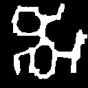
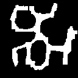
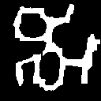
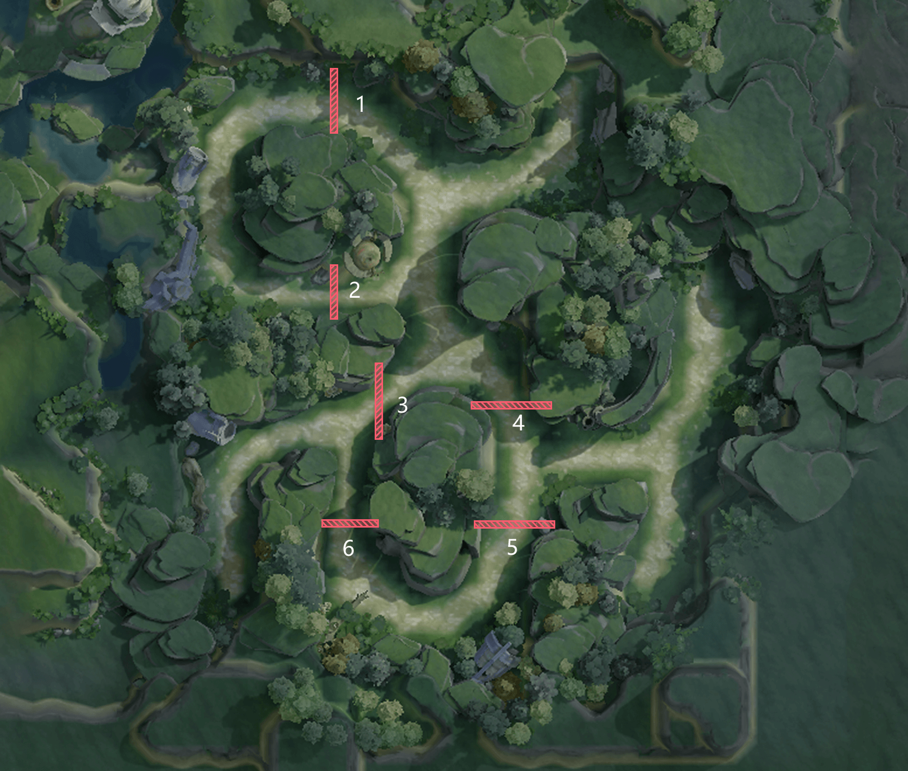
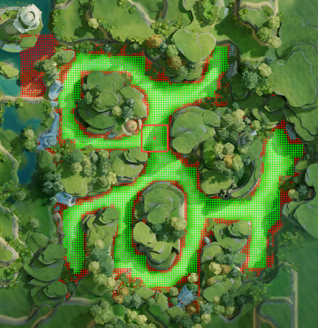

# Back To Realm v2 —— 基于 PPO 强化学习的寻宝游戏智能体

[](https://www.python.org/)
[](https://pytorch.org/)
[](LICENSE)
[](https://github.com/user/back-to-realm-v2/actions/workflows/ci.yml)

> 一个完整的本地强化学习项目：在网格化寻宝环境中，使用 PPO（Proximal Policy Optimization）算法训练智能体，从起点出发，收集宝物、拾取加速 Buff、释放闪现技能，最终抵达终点。

---

## 📖 目录

- [项目背景](#-项目背景)
- [环境说明](#-环境说明)
  - [地图结构](#地图结构)
  - [障碍物变体](#障碍物变体)
  - [地图元素](#地图元素)
  - [动作空间](#动作空间)
  - [观测空间](#观测空间)
  - [奖励设计](#奖励设计)
- [项目架构](#-项目架构)
- [神经网络模型](#-神经网络模型)
- [PPO 算法](#-ppo-算法)
- [快速开始](#-快速开始)
- [训练方式](#-训练方式)
  - [单进程训练](#单进程训练)
  - [多进程分布式训练](#多进程分布式训练)
- [训练监控面板](#-训练监控面板)
- [配置说明](#-配置说明)
- [测试](#-测试)
- [项目结构](#-项目结构)
- [贡献指南](#-贡献指南)
- [许可证](#-许可证)
- [引用](#-引用)

---

## 🎯 项目背景

**Back To Realm v2** 是一个用于研究和实验强化学习算法的本地训练项目。项目模拟了一个"英雄回归"的场景：智能体（英雄）被放置在一个带有障碍物的 2D 网格地图中，需要从起点出发，在有限的步数内尽可能多地收集散落在地图上的宝物，并最终到达终点。

该项目采用 **PPO（Proximal Policy Optimization）** 算法，这是当前深度强化学习领域最主流的策略梯度算法之一，具有良好的稳定性、样本效率以及实现简洁性。整个项目围绕以下核心理念构建：

- **模块化**：环境、特征工程、网络模型、算法、训练流程各自独立，便于替换和实验。
- **可观测性**：集成 Streamlit 训练面板，实时展示损失曲线、奖励变化等关键指标。
- **可扩展性**：支持单进程调试和多进程分布式训练，可从单机快速扩展到多核并行。
- **开源规范**：遵循 GitHub 开源社区最佳实践，包含 CI、Issue 模板、PR 模板、行为准则等。

---

## 🌍 环境说明

### 地图结构

游戏地图是一张 **128 × 128** 像素的 PNG 图片，通过像素灰度值解析为网格化的二值地图。白色区域（灰度 > 200）为可行走区域，黑色区域为障碍物。

**基础地图（无额外障碍物）：**



上图展示了没有任何额外障碍物的基础地图。白色（实际渲染为高亮区域）为智能体可行走的通路，黑色为不可穿越的墙体/障碍物。

### 障碍物变体

为增加环境多样性，项目提供了 **6 种不同的障碍物布局**。每次重置环境时，可以随机选择一种障碍物布局（当 `obstacle_random = true` 时），迫使智能体学习适应不同的地形结构。

| 障碍物 1 | 障碍物 2 | 障碍物 3 |
|:---:|:---:|:---:|
|  |  |  |

| 障碍物 4 | 障碍物 5 | 障碍物 6 |
|:---:|:---:|:---:|
|  |  |  |

**带有障碍物和樱桃（宝物）标记的地图示例：**



> 图中绿色圆点为起点（Start），红色圆点为终点（End），蓝色圆点为 Buff 刷新点，黄色樱桃图标为随机分布的宝物（Treasure）。

**樱桃视野范围示意图：**



> 智能体的局部观测范围是以自身位置为中心的 **11×11** 窗口。在此范围内的障碍物、宝物、Buff 等信息对智能体可见；范围外的物体只能通过方向与距离的模糊估计来感知。

### 地图元素

地图上的每个网格单元具有以下类型：

| 数值 | 颜色 | 含义 |
|:---:|:---:|:---|
| 0 | ⬛ 黑色 | 障碍物（不可通行） |
| 1 | ⬜ 白色 | 可行走地面 |
| 2 | 🟢 绿色 | 起点（Start） |
| 3 | 🔴 红色 | 终点（End） |
| 4 | 🟡 黄色 | 宝物（Treasure） |
| 6 | 🔵 蓝色 | 加速 Buff |

### 动作空间

智能体在每一步可以选择 **16 种离散动作**：

**普通移动（动作 0-7）：**

```
   7(NW)  0(N)  1(NE)
      \    |    /
   6(W) -- 英雄 -- 2(E)
      /    |    \
   5(SW)  4(S)  3(SE)
```

- 八个方向的移动，每个方向移动约 1 个单位距离
- 当加速 Buff 激活时，移动速度 ×1.5

**闪现技能（动作 8-15）：**

- 与普通移动相同的八个方向，但跳跃距离为 **16 个单位**
- 使用后进入冷却（默认 100 步），冷却期间按普通移动处理
- 可以穿越障碍物（在障碍物后方最近的可通行位置着陆）

### 观测空间

环境为智能体返回结构化的观测数据，经 `Preprocessor` 处理后成为一个 **964 维**的特征向量（`Config.FEATURE_LEN = 964`），包含以下信息：

| 特征组 | 维度 | 说明 |
|:---|:---:|:---|
| 当前位置归一化坐标 | 2 | `[x/128, z/128]` |
| 局部地图 One-Hot 编码 | 5×11×11 = 605 | 5 通道：障碍物/地面/终点/宝物/Buff |
| 局部地图原始值 | 11×11 = 121 | 局部 11×11 网格的原始 int 值 |
| 记忆标记 | 11×11 = 121 | 历史访问痕迹（衰减记忆） |
| 终点位置特征 | 6 | `[是否发现, 方向x, 方向z, 归一化x, 归一化z, 归一化距离]` |
| 历史位置特征 | 6 | 10 步前位置的方向与距离 |
| 宝物状态 | 13 | 每个宝物是否已被收集 |
| 宝物位置特征 | 13×6 = 78 | 每个宝物的发现状态、方向、位置、距离 |
| Buff 特征 | 8 | Buff 位置、剩余时间、已收集次数 |
| 技能特征 | 3 | 技能使用次数、是否可用、冷却进度 |
| 时间比例 | 1 | 当前步数 / 最大步数 |

### 奖励设计

奖励函数采用**多组件塑形**设计，在稀疏的终端奖励（到达终点 +150）和宝物收集奖励（每个 +100）之上，通过密集的中间信号引导智能体学习：

| 奖励组件 | 值 | 说明 |
|:---|:---:|:---|
| 步数惩罚 | -0.001/步 | 鼓励高效路径 |
| 终点距离奖励 | +0.1×Δd 或 +0.08×Δd | 接近终点获得正奖励，远离则惩罚 |
| 历史位置距离奖励 | ≤ 0.005×dist | 鼓励探索，远离起点 |
| 宝物可见奖励 | +0.0005×N | 视野内可见宝物数量 |
| 宝物收集奖励 | +5.0 | 收集到一个宝物 |
| 技能使用惩罚 | -0.5（-0.3 若同时收集宝物） | 鼓励合理使用闪现 |
| 停滞惩罚 | -0.0055 | 防止原地踏步 |
| 宝物距离奖励 | 宝物距离减少量 | 鼓励向最近宝物移动 |
| Buff 收集奖励 | +0.5（+0.001/步 加速期间） | 鼓励收集加速 Buff |
| 终端完成奖励 | +150 + (max_step - step) × 0.2 | 到达终点的总奖励 |

---

## 🏗 项目架构

项目采用经典的 **Actor-Learner** 架构，同时支持单进程训练和多进程分布式训练。

```
┌──────────────────────────────────────────────────────┐
│                    Launcher (launcher.py)             │
│           多进程编排：Actor 进程 + Learner 进程         │
└──────┬──────────────────────┬────────────────────────┘
       │                      │
       ▼                      ▼
┌──────────────┐    ┌──────────────────┐
│  Actor × N   │    │     Learner      │
│              │    │                  │
│  Env_v2      │    │  Algorithm       │
│  Agent       │───▶│  (PPO 学习器)     │
│  Preprocessor│ 队列 │                  │
│  ActorModel  │    │  LearnerModel    │
└──────────────┘    └──────────────────┘
       │                      │
       ▼                      ▼
┌──────────────┐    ┌──────────────────┐
│  环境 (env/)  │    │ 模型 (model/)     │
│  - 地图解析    │    │  - SpatialCNN    │
│  - 碰撞检测    │    │  - TreasureEnc   │
│  - 状态管理    │    │  - BuffEnc       │
│  - 奖励计算    │    │  - TemporalEnc   │
└──────────────┘    └──────────────────┘
```

### 核心模块

#### 1. 环境模块 (`env/`)

- **`env_v2.py`**：核心环境类 `Env_v2`，负责地图加载、状态管理、碰撞检测、物品收集判定。
  - 使用 PIL 读取 PNG 地图，通过灰度阈值解析可行走区域
  - 支持起点、终点、Buff、宝物、障碍物的随机化放置
  - 实现平滑移动：在两点间采样路径点，逐点检测碰撞
  - 闪现技能可以穿越障碍物，在障碍物后方最近可行走位置着陆
  - 局部视野：智能体只能看到 11×11 窗口内的地图细节
- **`config.toml`**：环境配置文件，控制随机化开关、冷却时间、宝物数量等参数。

#### 2. Agent 模块 (`PPO/agent.py`)

- **`Agent`**：智能体包装器，组合了观测预处理、动作采样和模型学习。
  - 维护胜率历史（最近 100 局）
  - 在训练过程中自动同步最新的 Learner 模型
  - 支持模型预加载（断点续训）

#### 3. 特征预处理 (`PPO/feature/`)

- **`preprocessor.py`**：`Preprocessor` 类，将原始环境观测转换为固定维度的特征向量。
  - 局部地图 One-Hot 编码（5 通道）
  - 全局记忆地图（衰减式历史轨迹记录）
  - 宝物/Buff/终点相对位置编码（方向 + 距离）
  - 可见性处理：视野外的物体使用模糊方向和距离估计
  - 合法动作掩码生成（防止重复卡墙动作）

- **`definition.py`**：
  - `SampleManager`：收集一个 episode 的轨迹数据，通过 **GAE（Generalized Advantage Estimation）** 计算优势函数和 TD-lambda 回报。
  - `reward_process`：9 组件的奖励塑形函数。
  - `SampleData`：单个 PPO 样本的数据容器。

#### 4. 算法模块 (`PPO/algorithm/`)

- **`algorithm.py`**：`Algorithm` 类，实现 PPO 学习器的完整逻辑。
  - Adam 优化器 + ReduceLROnPlateau 学习率调度
  - PPO-Clip 目标函数
  - 梯度裁剪（max_norm=0.5）
  - 自动保存 checkpoint 和训练指标（`metrics.json`）

#### 5. 模型模块 (`PPO/model/model.py`)

- 详见下方 [神经网络模型](#-神经网络模型) 章节。

#### 6. 训练工作流 (`PPO/workflow/`)

- **`train_workflow.py`**：单进程训练的完整流程，包含 episode 循环、样本收集、模型保存等。

#### 7. 启动器 (`launcher.py`)

- 支持命令行参数配置的多进程 Actor-Learner 分布式训练框架。
- Actor 崩溃自动重启。
- 可选一键启动 Streamlit 训练面板。

#### 8. 训练面板 (`dashboard.py`)

- 基于 Streamlit + Plotly 的实时训练指标可视化。

---

## 🧠 神经网络模型

模型采用**多编码器融合架构**，针对不同语义的特征设计专门的编码器，最后将各编码器输出拼接后通过全连接层输出策略（动作概率分布）和价值（状态值估计）。

```
输入特征向量 (964维)
       │
       ├──► 当前位置编码 ──► CurPosEncoder (Linear → d_model)
       │
       ├──► 局部地图 ──► SpatialAttentionCNN
       │    │              ├── Terrain Conv (5→32 ch)
       │    │              ├── Local Conv (1→16 ch)
       │    │              ├── Memory Conv (1→16 ch)
       │    │              ├── 融合 Conv (64→64 ch)
       │    │              ├── 2D 位置编码
       │    │              └── MultiheadSelfAttention (8 heads)
       │    │                   → Mean Pooling
       │    │
       ├──► 终点特征 ──► PositionEncoder (6→64)
       │
       ├──► 历史位置 ──► PositionEncoder (6→64)
       │
       ├──► 宝物特征 (13×7) ──► TreasureEncoder
       │    │                     ├── PositionEncoder × 13
       │    │                     ├── State Embedding
       │    │                     └── MultiheadAttention (4 heads)
       │    │                          → Mean Pooling
       │    │
       ├──► Buff 特征 ──► BuffEncoder (8→64)
       │
       ├──► 技能特征 ──► TalentEncoder (3→64)
       │
       └──► 时间特征 ──► TemporalEncoder (4→64)

所有编码器输出 (8 × 64 = 512)
       │
       ▼
   Decoder (512 → 192 → 128)
       │
       ├──► Policy Head (128 → 16) ──► Softmax ──► 动作概率
       │
       └──► Value Head (128 → 1) ──► 状态价值
```

### 关键设计

- **SpatialAttentionCNN**：使用 2D 卷积 + 多头自注意力机制处理局部地图，捕捉空间结构和路径信息。包含 2D 位置编码以保留空间位置信息。
- **TreasureEncoder**：独立编码每个宝物的位置和状态，通过注意力机制建模宝物之间的相对重要性。
- **TemporalEncoder**：编码时间相关信息（技能冷却、Buff 剩余时间、记忆覆盖率、时间进度），帮助智能体做时序决策。
- **PositionEncoder**：统一的位置特征编码器，将 6 维位置信息（发现标志 + 方向 + 归一化坐标 + 距离）映射到 64 维嵌入空间。

---

## 📈 PPO 算法

项目实现了标准的 **PPO-Clip** 算法，关键参数如下：

| 参数 | 值 | 说明 |
|:---|:---:|:---|
| γ (Gamma) | 0.988 | 折扣因子 |
| λ (Lambda) | 0.96 | GAE 参数 |
| ε (Clip) | 0.25 | PPO 裁剪范围 |
| 初始学习率 | 2×10⁻⁴ | Adam 优化器 |
| 最小学习率 | 8×10⁻⁶ | ReduceLROnPlateau |
| VF Coefficient | 0.67 | 价值函数损失权重 |
| Entropy Beta | 0.01 | 熵正则化系数 |

### 损失函数

**总损失 = VF系数 × 价值损失 + 策略损失 - 熵系数 × 熵损失**

其中：
- **价值损失**：使用 PPO 风格的裁剪价值损失，防止价值函数更新过大
- **策略损失**：使用 PPO-Clip 目标函数，限制新旧策略比率在 `[1-ε, 1+ε]` 范围内
- **熵损失**：鼓励策略保持一定的随机性，促进探索

### GAE 优势估计

采用 **Generalized Advantage Estimation (GAE)** 在 episode 结束时反向计算每个时间步的优势函数：

```
δₜ = rₜ₊₁ + γ·V(sₜ₊₁) - V(sₜ)
Aₜ = δₜ + γ·λ·δₜ₊₁ + (γ·λ)²·δₜ₊₂ + ...
```

---

## 🚀 快速开始

### 环境要求

- Python 3.10 及以上
- 推荐使用 CUDA 兼容的 GPU（也可使用 CPU 训练）

### 安装

```bash
# 创建虚拟环境
python -m venv .venv

# 激活虚拟环境 (Windows PowerShell)
.\.venv\Scripts\Activate.ps1

# 激活虚拟环境 (Linux/macOS)
source .venv/bin/activate

# 升级 pip
python -m pip install --upgrade pip

# 安装项目（含训练面板和开发依赖）
python -m pip install -e ".[dashboard,dev]"

# 如需手动游玩体验，安装 pygame 依赖
python -m pip install -e ".[game]"
```

### 运行测试

```bash
pytest
```

### 手动体验环境

```bash
# 启动 Pygame 交互式环境
python -m env.env_v2
```

**操作说明：**

| 按键 | 动作 |
|:---|:---|
| `W` / `E` / `D` / `S` / `Z` / `Q` / `A` / `C` | 八个方向移动 |
| `Shift` + 方向键 | 闪现技能 |
| `R` | 重置环境 |
| `ESC` | 退出 |

---

## 🏋️ 训练方式

### 单进程训练

适合调试和开发阶段，所有操作在同一进程中执行：

```bash
python -m PPO.workflow.train_workflow
```

单进程训练流程：

1. 初始化环境和 Agent
2. 若存在 latest checkpoint，自动加载
3. 循环执行 episode：
   - 重置环境，收集轨迹数据
   - 使用 GAE 计算优势和回报
   - 执行 PPO 学习更新
4. 每 30 分钟自动保存模型 checkpoint

### 多进程分布式训练

适合正式训练，充分利用多核 CPU 和 GPU：

```bash
# 使用 4 个 Actor 进程，GPU 训练
python launcher.py --actors 4 --device cuda

# 使用 8 个 Actor，CPU 训练
python launcher.py --actors 8 --device cpu

# 自定义批大小和超时
python launcher.py --actors 4 --device cuda --batch-size 2048 --batch-timeout 10.0

# 同时启动训练面板
python launcher.py --actors 4 --device cuda --dashboard
```

**命令行参数：**

| 参数 | 默认值 | 说明 |
|:---|:---:|:---|
| `--actors` | 4 | Actor 进程数量 |
| `--device` | cuda | 计算设备（cpu / cuda） |
| `--batch-size` | 1024 | Learner 每次更新的样本数 |
| `--batch-timeout` | 5.0 | 超时后使用部分批次训练（秒） |
| `--dashboard` | false | 是否自动启动 Streamlit 面板 |

**架构说明：**

- **Actor 进程**：每个 Actor 独立运行环境和 Agent，采集轨迹数据通过 `multiprocessing.Queue` 发送给 Learner。
- **Learner 进程**：从队列收集样本，累积到 batch_size 后执行一次 PPO 更新，更新后的模型保存为 `model.ckpt-latest.pkl`。
- **模型同步**：Actor 每 15 个 episode 自动从磁盘加载最新的 Learner 模型。

---

## 📊 训练监控面板

启动 Streamlit 训练面板以实时监控训练进度：

```bash
streamlit run dashboard.py
```

面板提供以下功能：

- **关键指标卡片**：学习步数、总损失、平均奖励、当前学习率
- **最新指标详情**：TD 回报均值、价值损失、策略损失、熵损失、优势均值/标准差、Clip 比例
- **训练曲线**：
  - 总损失 / 价值损失 / 策略损失 / 熵损失 随学习步数变化
  - 平均奖励趋势图
  - 平均优势趋势图
- **Checkpoint 列表**：当前所有已保存的模型文件
- **自动刷新**：可调节刷新间隔（0.5-5 秒）


---

## ⚙️ 配置说明

### 环境配置 (`env/config.toml`)

```toml
[conf]
# 起点/终点/Buff 的默认坐标（仅在对应 random=false 时生效）
start = [111, 70]
end = [20, 55]
buff = [57, 68]

# 随机化开关
start_random = true       # 起点随机
end_random = true         # 终点随机
buff_random = true        # Buff 随机
obstacle_random = true    # 障碍物随机
treasure_random = true    # 宝物随机

# Buff 重生冷却（步数）
buff_cooldown = 100

# 技能冷却（步数）
talent_cooldown = 100

# 随机宝物数量
treasure_count = 10

# 技能类型（1=超级闪现）
talent_type = 1

# 每局最大步数
max_step = 2000
```

### 训练配置 (`PPO/conf/conf.py`)

| 参数 | 默认值 | 说明 |
|:---|:---:|:---|
| `UPDATE_FREQ` | 100 | 每 N 次学习后同步 Actor 模型 |
| `LOAD_FREQ` | 15 | Actor 每 N 个 episode 加载最新模型 |
| `SAVE_FREQ` | 600 | 模型保存间隔（秒） |
| `CAPACITY` | 100,000 | Learner 经验池最大容量 |
| `GAMMA` | 0.988 | 折扣因子 |
| `TDLAMBDA` | 0.96 | TD-lambda 参数 |
| `START_LR` | 2×10⁻⁴ | 初始学习率 |
| `END_LR` | 8×10⁻⁶ | 最小学习率 |
| `BETA_START` | 0.01 | 熵正则化系数 |
| `CLIP_PARAM` | 0.25 | PPO 裁剪范围 |
| `VF_COEF` | 0.67 | 价值函数损失权重 |

---

## 🧪 测试

项目包含 5 组 pytest 测试用例，覆盖核心契约：

```bash
pytest

# 带详细输出
pytest -v

# 运行特定测试文件
pytest tests/test_environment_contract.py
```

| 测试文件 | 覆盖内容 |
|:---|:---|
| `test_config_contracts.py` | 配置维度一致性、特征长度正确性 |
| `test_dashboard.py` | 指标加载、空数据/损坏数据处理 |
| `test_environment_contract.py` | 环境 reset/step 行为、边界条件、胜利/超时判定 |
| `test_model_contract.py` | 模型前向传播、输入输出维度、数据拆分 |
| `test_sample_manager.py` | 样本管理器的增删操作和 GAE 计算 |

---

## 📁 项目结构

```
back-to-realm-v2/
│
├── env/                          # 环境模块
│   ├── env_v2.py                 # 核心环境类 Env_v2
│   ├── env.py                    # 环境辅助功能
│   └── config.toml               # 环境配置文件
│
├── PPO/                          # PPO 训练模块
│   ├── agent.py                  # Agent 包装器（观测→动作→学习）
│   ├── algorithm/
│   │   └── algorithm.py          # PPO 学习器实现
│   ├── conf/
│   │   ├── conf.py               # 训练和特征维度配置
│   │   └── train_env_conf.toml   # 训练环境配置
│   ├── feature/
│   │   ├── preprocessor.py       # 观测预处理与特征工程
│   │   └── definition.py         # 常量、奖励塑形、样本管理
│   ├── model/
│   │   └── model.py              # 神经网络模型定义
│   └── workflow/
│       └── train_workflow.py     # 单进程训练工作流
│
├── map/                          # 地图资源
│   ├── map.png                   # 基础地图（无额外障碍物）
│   ├── map.psd                   # 地图源文件
│   ├── obstacle_1~6.png          # 6 种障碍物变体
│   ├── map_cherry_with_obstacle-*.png  # 完整地图展示
│   └── cherry_view_size-*.png    # 樱桃视野范围示意图
│
├── tests/                        # 测试用例
│   ├── test_config_contracts.py
│   ├── test_dashboard.py
│   ├── test_environment_contract.py
│   ├── test_model_contract.py
│   └── test_sample_manager.py
│
├── ckpt/                         # 模型检查点
│   ├── dump_model/               # 训练中保存的模型
│   ├── eval_model/               # 评估模型
│   └── preload_model/            # 预加载模型
│
├── log/                          # 训练日志
├── metrics.json                  # 训练指标记录
├── dashboard.py                  # Streamlit 训练面板
├── launcher.py                   # 多进程启动器
├── pyproject.toml                # 项目元数据和依赖
│
├── .github/                      # GitHub 社区文件
│   ├── ISSUE_TEMPLATE/           # Issue 模板
│   ├── PULL_REQUEST_TEMPLATE.md  # PR 模板
│   └── workflows/ci.yml          # CI 工作流
│
├── CHANGELOG.md                  # 变更日志
├── CITATION.cff                  # 引用信息
├── CODE_OF_CONDUCT.md            # 行为准则
├── CONTRIBUTING.md               # 贡献指南
├── LICENSE                       # MIT 许可证
└── SECURITY.md                   # 安全策略
```

---

## 🤝 贡献指南

我们欢迎任何形式的贡献！请参阅 [CONTRIBUTING.md](CONTRIBUTING.md) 了解详细的开发流程。

**关键原则：**

- 保持 checkpoint、日志、指标和缓存文件不入 Git
- 修改特征/样本维度时同步更新测试和文档
- 行为变更的 PR 务必包含测试
- 提交 PR 前运行 `pytest` 和 `ruff check .`
- 优先提交小而聚焦的 PR

**开发环境搭建：**

```bash
python -m venv .venv
.\.venv\Scripts\Activate.ps1
python -m pip install -e ".[dashboard,dev]"
```

---

## 📄 许可证

本项目基于 [MIT License](LICENSE) 开源发布。

---

## 📚 引用

如果您在学术研究中使用本项目，请引用：

```bibtex
@software{back_to_realm_v2,
  author       = {Back To Realm contributors},
  title        = {Back To Realm v2: PPO Reinforcement Learning for Treasure-Hunt Grid Environments},
  year         = 2025,
  url          = {https://github.com/user/back-to-realm-v2}
}
```

详细信息请参阅 [CITATION.cff](CITATION.cff)。

---

<p align="center">
  <b>Back To Realm v2</b> —— 从零构建强化学习智能体，在寻宝之旅中探索 PPO 的奥秘 🗺️✨
</p>
